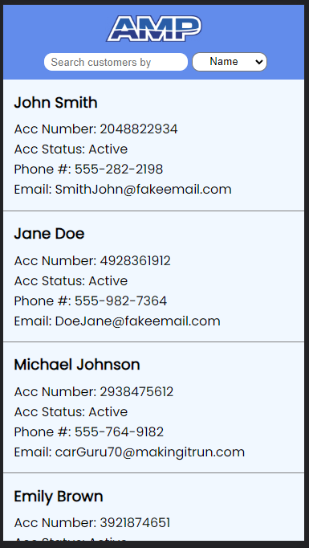
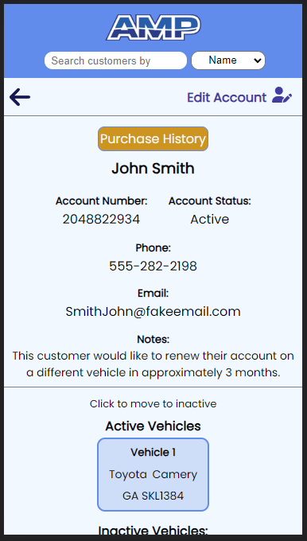

## [AMP CSR PORTAL](https://amp-csr-portal.onrender.com)

The AMP CSR Portal is a user friendly solution for the customer service specialist on the go. 
Designed with mobile devices in mind, the AMP CSR Portal allows customer service representatives to:
- easily locate customers based on various search criteria
- edit customers' information 
- view the customers' transaction history 
- add or remove subscriptions from vehicles 

## Technologies Used

- React
- JSX
- CSS

## Usage

[LiveLink](https://amp-csr-portal.onrender.com)

1. Simply open the application and you will see a list of customers and a search bar.
2. Either click on the desired customer, or you may search through the list by name, account number, phone number, or email. 
3. Once a customer is located, clicking on the customer will take you to a detailed view of the customer's information.
4. You may simply view the information and purchase history of a customer or freely edit the information fields making sure to save your changes if desired. 
5. If a customer needs to switch subscriptions from one vehicle to the next, it's as easy as adding a new active vehicle by including the make, model, and tag number in the edit fields. 
6. To add a new subscription vehicle, click on the blue plus symbol next to the active vehicle heading. 
7. Clicking on a subscribed vehicle will prompt you if you'd like to move that vehicle to inactive where it can then be deleted if desired. 

## Examples

## Contact Information

- Eddie Zaboroskie
- zaboroskie.edward@gmail.com
- eddiezaboroskie.com
